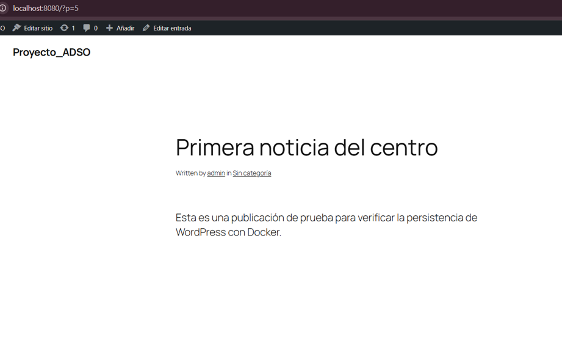
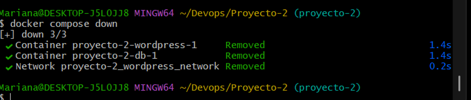
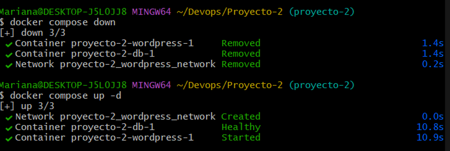
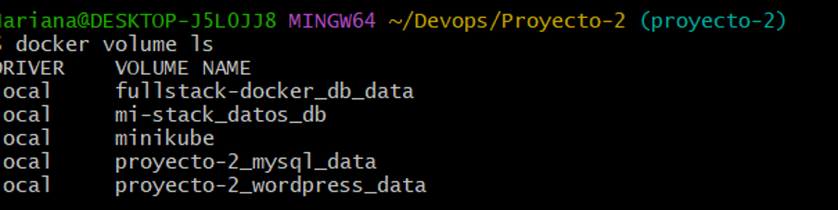
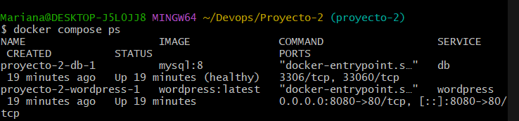

# Proyecto 2 — WordPress persistente con Docker Compose

## 1. Descripción del proyecto

Este proyecto consiste en implementar un sitio web de WordPress utilizando Docker Compose.

El proyecto utiliza dos servicios principales:

* **WordPress:** permite crear y administrar el sitio web y sus publicaciones.
* **MySQL:** almacena la información de WordPress, como publicaciones y configuraciones.

El objetivo principal es que el sitio pueda iniciarse con Docker Compose y que la información no se pierda aunque los contenedores sean eliminados y creados nuevamente.

---

## 2. Tecnologías utilizadas

* Docker
* Docker Compose
* WordPress
* MySQL 8
* Git y GitHub

---

## 3. Estructura del proyecto

```text
Proyecto-2/
│
├── docker-compose.yml
├── .env
├── .env.example
├── .gitignore
├── README.md
│
└── evidencias/
    ├── primeranoticia.png
    ├── down-up.png
    ├── inicializado.png
    ├── volumes.png
    └── contenedores.png
```

> El archivo `.env` contiene información sensible y no se incluye en el repositorio gracias al `.gitignore`.

---

## 4. Configuración mediante variables de entorno

Las variables de configuración se almacenan en el archivo `.env`.

Ejemplo:

```env
MYSQL_DATABASE=wordpress
MYSQL_USER=wp_user
MYSQL_PASSWORD=wp_password
MYSQL_ROOT_PASSWORD=root_password

WORDPRESS_PORT=8080
```

El archivo `.env.example` se incluye como referencia para conocer las variables necesarias sin exponer los valores reales.

---

## 5. Servicios utilizados

### MySQL

Se utiliza la imagen:

```yaml
image: mysql:8
```

MySQL se encarga de almacenar los datos de WordPress.

El servicio se identifica dentro de Docker Compose con el nombre:

```text
db
```

### WordPress

Se utiliza la imagen:

```yaml
image: wordpress:latest
```

WordPress es la aplicación que permite administrar y visualizar el sitio web.

El servicio se identifica como:

```text
wordpress
```

El sitio se puede acceder desde:

```text
http://localhost:8080
```

---

## 6. Volúmenes

Se utilizan dos volúmenes para conservar la información:

```yaml
volumes:
  mysql_data:
  wordpress_data:
```

### `mysql_data`

Guarda los datos de la base de datos MySQL.

```yaml
- mysql_data:/var/lib/mysql
```

### `wordpress_data`

Guarda los archivos de WordPress, incluyendo el contenido del sitio.

```yaml
- wordpress_data:/var/www/html
```

Gracias a estos volúmenes, los datos permanecen aunque los contenedores sean eliminados.

---

## 7. Red personalizada

Se creó una red personalizada llamada:

```text
wordpress_network
```

Los servicios `db` y `wordpress` utilizan esta red para poder comunicarse entre ellos.

```yaml
networks:
  wordpress_network:
    driver: bridge
```

La conexión se realiza utilizando el nombre del servicio de MySQL:

```yaml
WORDPRESS_DB_HOST: db:3306
```

No se utiliza directamente una dirección IP porque Docker permite encontrar el contenedor mediante el nombre del servicio.

---

## 8. Healthcheck

MySQL tiene configurado un `healthcheck`:

```yaml
healthcheck:
  test: ["CMD", "mysqladmin", "ping", "-h", "localhost"]
  interval: 10s
  timeout: 5s
  retries: 5
```

El `healthcheck` permite comprobar si MySQL está funcionando correctamente y listo para recibir conexiones.

---

## 9. `depends_on`

WordPress depende de que MySQL esté saludable antes de iniciar:

```yaml
depends_on:
  db:
    condition: service_healthy
```

De esta manera, WordPress espera a que MySQL esté listo antes de intentar conectarse.

---

## 10. Ejecución del proyecto

Para iniciar los servicios se utiliza:

```bash
docker compose up -d
```

El parámetro `-d` permite ejecutar los contenedores en segundo plano.

Para comprobar el estado de los servicios:

```bash
docker compose ps
```

Resultado esperado:

* MySQL: `Up (healthy)`
* WordPress: `Up`

---

## 11. Instalación de WordPress

Después de iniciar los contenedores, se accede desde el navegador mediante:

```text
http://localhost:8080
```

Se selecciona el idioma y se completan los datos iniciales de WordPress.

---

## 12. Contenido de prueba

Se creó una publicación de prueba llamada:

**Primera noticia del centro**

Esta publicación se utiliza para comprobar posteriormente que los datos permanecen almacenados.

### Evidencia — Publicación antes de la prueba



---

## 13. Prueba de persistencia

Primero se detuvieron y eliminaron los contenedores utilizando:

```bash
docker compose down
```

Este comando elimina los contenedores y la red, pero **no elimina los volúmenes**.

Posteriormente, se volvieron a iniciar los servicios:

```bash
docker compose up -d
```

Después de iniciar nuevamente WordPress, la publicación **“Primera noticia del centro”** continuó disponible.

Esto demuestra que la información fue conservada mediante los volúmenes de Docker.

### Evidencia — Contenedores eliminados y reiniciados



### Evidencia — Contenido después de volver a iniciar



---

## 14. Evidencia de los volúmenes

Se utilizó el siguiente comando:

```bash
docker volume ls
```

Los volúmenes creados para este proyecto son:

```text
proyecto-2_mysql_data
proyecto-2_wordpress_data
```

Estos permiten conservar los datos de MySQL y los archivos de WordPress.

### Evidencia — `docker volume ls`



---

## 15. Evidencia del estado de los servicios

Se verificó el funcionamiento mediante:

```bash
docker compose ps
```

MySQL debe aparecer como:

```text
Up (healthy)
```

y WordPress como:

```text
Up
```

### Evidencia — `docker compose ps`



---

# 16. Preguntas de la actividad

## 1. ¿Qué comando también elimina los datos y por qué se debe tener cuidado?

El comando es:

```bash
docker compose down -v
```

La opción `-v` elimina también los volúmenes asociados al proyecto.

Esto puede provocar la pérdida de los datos almacenados en MySQL y de los archivos persistentes de WordPress.

Por esta razón se debe utilizar con cuidado.

---

## 2. ¿Por qué WordPress se conecta al host `db` y no a una IP?

WordPress utiliza:

```text
db:3306
```

porque `db` es el nombre del servicio de MySQL definido en `docker-compose.yml`.

Docker permite que los contenedores se encuentren mediante el nombre del servicio dentro de la misma red.

Esto es más conveniente que utilizar una IP, porque la IP de un contenedor puede cambiar cuando el contenedor se vuelve a crear.

---

## 3. ¿Qué aporta `healthcheck` frente a un `depends_on` simple?

Un `depends_on` simple puede indicar que un servicio debe iniciarse después de otro, pero eso no significa necesariamente que el servicio ya esté listo para funcionar.

El `healthcheck` comprueba el estado real de MySQL.

En este proyecto:

```yaml
depends_on:
  db:
    condition: service_healthy
```

hace que WordPress espere hasta que MySQL sea considerado saludable antes de iniciar.

Esto ayuda a evitar problemas de conexión durante el arranque.

---

# 17. Conclusión

El proyecto permite ejecutar WordPress y MySQL mediante Docker Compose utilizando una red personalizada, variables de entorno, volúmenes persistentes, `healthcheck` y `depends_on`.

La prueba realizada demuestra que los datos de WordPress permanecen disponibles después de eliminar y volver a crear los contenedores, gracias al uso de volúmenes.

Por lo tanto, el proyecto cumple con el objetivo de mantener la información persistente y facilitar el despliegue del sitio mediante un solo comando.
